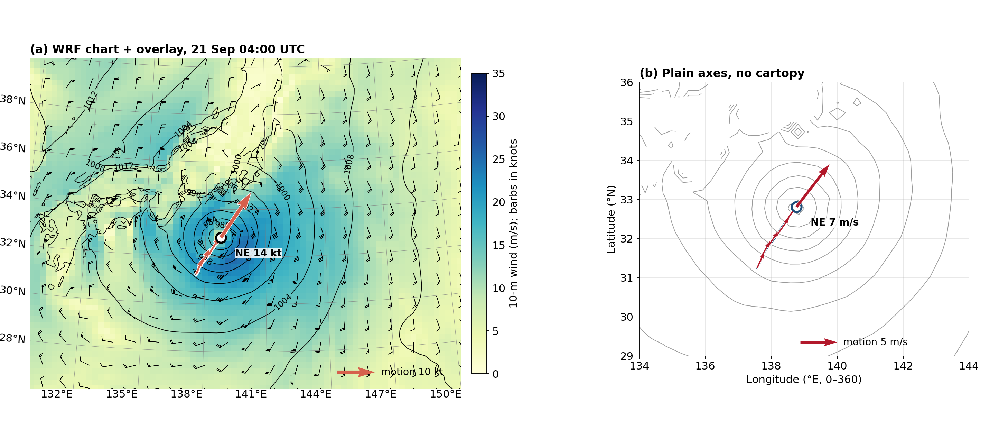
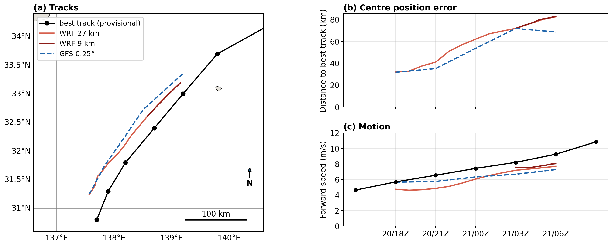

# stormtrack

A small, data-agnostic tropical-cyclone centre tracker. One Python file, no model-specific libraries.

It follows a storm through **any gridded output it can open**: WRF (static or vortex-following
moving nests), GFS / GEFS GRIB, ERA5 NetCDF, MPAS once remapped to a lat-lon grid, or any other
NetCDF / GRIB / Zarr file with a pressure field. It finds the pressure variable, coordinates and
valid times by itself, refines the centre below the grid spacing, and estimates the storm's motion
vector (forward speed and heading).

```bash
python stormtrack.py "wrfout_d02_*" --first-guess 31.3 137.9 --out track.csv --plot track.png
python stormtrack.py "gfs.t18z.pgrb2.0p25.f0*" --first-guess 31.3 137.9 --window-h 6
python stormtrack.py era5_msl_sep2026.nc --box 20 40 125 150
```

```python
import stormtrack as st
df = st.track(st.frames(["a.nc", "b.nc"]), first_guess=(31.3, 137.9))
```

## Method

The centre is the **minimum of sea-level pressure**, the quantity that is defined the same way in every
model and reanalysis. Each frame goes through four steps.

1. **Search area.** On the first frame the search is a disc around the first guess. If no guess is
   given, it uses the whole grid or a `--box`. After that the disc is centred on the position
   **extrapolated from the last motion** (persistence), not on the last position. Its radius is
   `max_dev_speed × Δt + 50 km`, kept between 100 and 600 km. For the second frame, when no motion
   is known yet, it uses `max_speed`. A deeper low elsewhere on the grid, or a wide output interval,
   therefore does not pull the track away.
2. **Candidate.** The grid point with the lowest pressure inside the disc. A border of `--edge` grid
   points is skipped on limited-area grids.
3. **Sub-grid refinement.** The final centre is the **pressure-deficit centroid** within `--refine-km`
   of the candidate:
   `x_c = Σ w·x / Σ w`, with weights `w = max(p_env − p, 0)`, where `p_env` is the 90th percentile of
   pressure in that disc. The sums are taken in a local tangent plane, so the result is safe across
   the dateline and on rotated or curvilinear grids. This removes the grid-step jitter of a plain
   minimum. On synthetic storms the centre error drops from 9 km to 0.4 km on a 0.25° grid, and from
   3 km to 0.1 km on a 9 km grid.
4. **Quality.** `depth = p_env − p_min`. Frames shallower than `--min-depth` hPa are flagged `weak`.
   Frames where nothing can be searched are flagged `lost`, and the tracker stops after
   `max_misses` consecutive lost frames.

**Motion vector.** A least-squares straight line is fitted to the east and north positions (tangent
plane) of all fixes within `±window_h` hours. Its slope gives `u_ms` and `v_ms`, the forward speed and
the heading in degrees from north. Because it uses several fixes at once, it is much less noisy than
differencing consecutive fixes, and it does not depend on the output interval (20 min or 6 h).

**Pressure field.** The tracker takes the first sea-level pressure variable it finds:
msl, prmsl, slp, PMSL, psl and similar names. Units are detected automatically (Pa or hPa).
- If only surface pressure is available, as in raw `wrfout` files, it is reduced to sea level
  hypsometrically using terrain height and 2-m temperature. Points above `--mask-terrain` m are then
  ignored, because the reduction is meaningless over mountains.
- Inland lakes at altitude are not mistaken for the storm.
- Coordinates are **re-read on every frame**, so moving nests work as they are.

**Output columns.** `time, lat, lon` (refined centre), `grid_lat, grid_lon` (grid-point minimum),
`pmin_hpa, depth_hpa`, `vmax_ms` (largest 10-m wind within 200 km, if winds are in the file),
`flag, source, speed_ms, speed_kt, heading_deg, u_ms, v_ms`.

## Overlay on your own charts

`overlay()` draws the tracked storm on any **existing** matplotlib axes: a cartopy map of any
projection (e.g. a chart from wrf-python or WRF_Python_Scripts) or a plain lon/lat plot (0–360 or
−180..180). It draws the past track, the centre at the chart's valid time, motion arrows and a short
"NE 14 kt" label. Add one line after your own plotting code:

```python
import stormtrack as st
trk = st.read_track("track.csv")              # or the DataFrame returned by st.track(...)
st.overlay(ax, trk, valid_time=valid_dt)      # ax = your map, valid_dt = the chart's time
```

All visual choices are fields of `OverlayStyle`: colours, line width, arrow spacing, arrow length
(m/s per inch, or `"auto"`), half-length past arrows, white halo, label units (kt or m/s), key position
and z-order. Change them for one call with keywords, e.g.
`st.overlay(ax, trk, t, units="m/s", arrow_color="m", arrow_every=0)`, or edit the defaults in the class.
The function returns the matplotlib objects it drew, so they can still be changed afterwards.
`track_at(trk, t)` gives the interpolated centre and motion at any time, for your own labels.
The arrow scale is fixed in m/s per inch by default, so a sequence of charts (one per forecast hour)
keeps comparable arrow lengths. See `examples/overlay_demo.py`.



## Checks

`python test_stormtrack.py` builds synthetic storms with **known** motion, writes them to files,
and runs the tracker exactly as a user would. Four cases:
- a regular 0–360° grid with noise, in Pa,
- a rotated WRF-like grid with only surface pressure plus terrain and a mountain nearby,
- a moving nest,
- a dateline crossing with a deeper decoy low 900 km away.

All pass: speed error ≤ 0.2 %, heading error ≤ 0.25°.

`examples/compare_dujuan.py` runs the same code, unchanged, on three real inputs for Typhoon Dujuan
(20 Sep 18Z – 21 Sep 06Z 2026) and compares them with the provisional IBTrACS best track:

| Input | Fixes | Mean distance to best track | Mean speed bias |
|---|---|---|---|
| WRF 27 km (surface pressure only, reduced) | 13 hourly | 58 km | −1.4 m/s |
| WRF 9 km (20-min output) | 10 | 78 km* | −1.0 m/s |
| GFS 0.25° raw GRIB | 5 three-hourly | 52 km | −1.1 m/s |

\*The 9 km output only covers 03–06Z, when every input was furthest from the best track. These are
errors of the forecasts, not of the tracker: the 9 km and 27 km tracks agree with each other within
about 1 km.



## Limits

- **Pressure only.** Vorticity at 850 and 700 hPa or a 10-m wind minimum would help locate weak or
  sheared systems, such as tropical depressions or storms undergoing extratropical transition, where
  the pressure minimum is broad. They are not used, because not every dataset carries them.
- **One storm per run.** Give a first guess for each storm.
- **Gridded data.** MPAS must be remapped to lat-lon first, for example with `convert_mpas`.
  Unstructured meshes are not read directly.
- **Sea-level reduction.** It is only as good as the terrain and temperature fields in the file.

## Dependencies

numpy, pandas, xarray (+ netCDF4). Optional: scipy (`--smooth-km`), cfgrib (GRIB), matplotlib and
cartopy (`--plot`). All are permissively licensed.

## Author

SUMAILI NDEBA Bienvenu — sumailib@gmail.com; sumaili.bienvenu@um6p.ma

## Licence

Code is free for use: MIT licence, see `LICENSE`.
